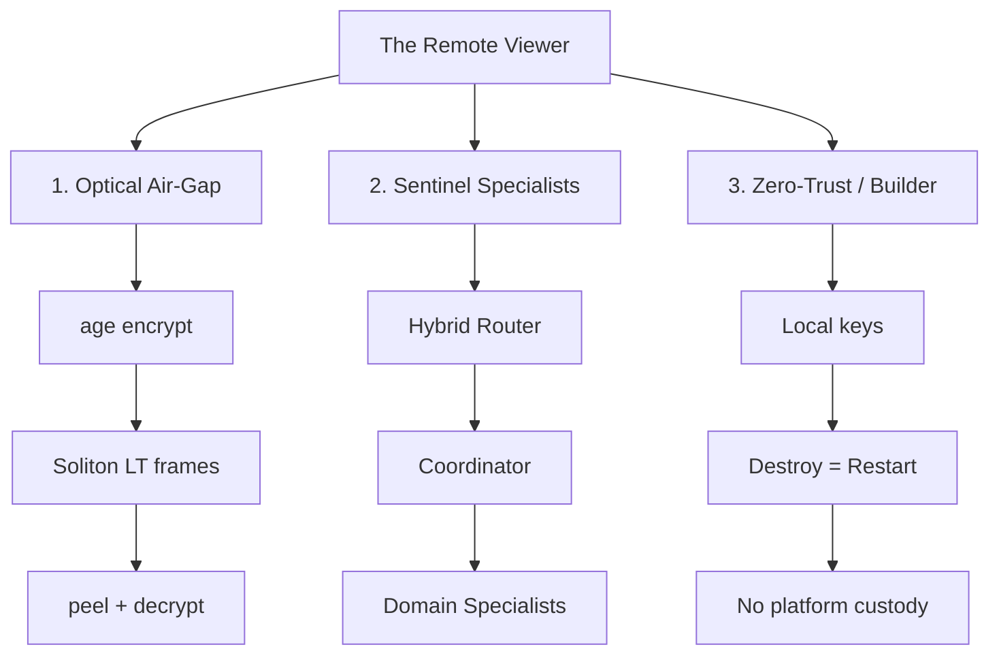
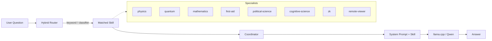

# The Remote Viewer

**Local-first · Zero-trust · On-device identity · No platform custody · Install-anywhere**

> "When our technology rewires how information flows, that's when invention begins."
> — **John Squires**, Director of the U.S. Patent and Trademark Office


[](https://github.com/Sentinel-Archetecht/The-Remote-Viewer/actions/workflows/ci.yml)
[](https://github.com/Sentinel-Archetecht/The-Remote-Viewer/actions/workflows/build-posture-pack.yml)

Repository: [github.com/Sentinel-Archetecht/The-Remote-Viewer](https://github.com/Sentinel-Archetecht/The-Remote-Viewer)  
**Working branch:** [`TheRemoteViewer`](https://github.com/Sentinel-Archetecht/The-Remote-Viewer/tree/TheRemoteViewer)

**Prefer pictures?** → **[Visual Guide](VISUAL-GUIDE.md)** (sight-first flowcharts, no jargon)

---

## Start here — three paths

One repo. Three real entry points.



| Path | What it is |
|------|------------|
| **[1. Optical air-gap](optical-airgap/README.md)** | Proven transport: age encrypt → Robust Soliton LT → peel → decrypt. Verified on GrapheneOS + Termux 2026-07-31. |
| **[2. Sentinel specialists + router](#live-proof--sentinel-llm-coordinator--specialists)** | On-device intelligence layer. Coordinator routes to domain experts. Hybrid router live. |
| **[3. Zero-trust / Builder](#zero-trust--builder)** | Keys, posture, Destroy = Restart, full stack rules. |

**Free stays free.** Optional paid packs may be offered later via Phantom / Solana.  
**There is no live in-app shop checkout yet.**

---

## Live Proof — Optical Air-Gap (age + Soliton LT)

**Operational on-device. 2026-07-31.** GrapheneOS\* + Termux (Pixel-class).

```
plaintext → age encrypt → Robust Soliton LT (TRVL frames) → peel → age decrypt
```

### Done

- [x] Encrypt-first with open-source **age** (Rust CLI + TS path)
- [x] **Robust Soliton** LT fountain (not RaptorQ default) — [Sentinel Standard](optical-airgap/SENTINEL-STANDARD.md)
- [x] TRVL framing + golden degree vectors (TS ↔ Rust interop)
- [x] `trv-optical` CLI: `keygen` · `encrypt` · `decrypt` · `frame-stream` · `frame-peel`
- [x] Full chain on device recovered live plaintext (`secret viewer message`)
- [x] One-shot automation script [`optical-airgap/scripts/e2e-age-lt.sh`](optical-airgap/scripts/e2e-age-lt.sh) (`$HOME` paths for Termux)
- [x] Offline QR sender/receiver HTML (no CDN in core path)
- [x] Gate v2 quality checks · FPS profiles
- [x] Open-source inventory — zero Meta / Google / Microsoft in core — [OPEN-SOURCE.md](optical-airgap/OPEN-SOURCE.md)
- [x] Workspace member so `cargo run` works under repo root
- [x] Install + troubleshooting for Termux — [INSTALL.md](optical-airgap/INSTALL.md)

### Not done / optional

- [ ] Multi-device screen↔camera optical lab (Acer ↔ phone)
- [ ] Optional jsQR vendor drop for browsers without BarcodeDetector
- [ ] `cargo vendor` offline cache (see `optical-airgap/rust/OFFLINE.md`)
- [ ] Acoustic contingency (deferred) — [PHASE2-R6.md](optical-airgap/PHASE2-R6.md)
- [ ] Exact payload-length field in LT (today: zero-pad trim)

\* GrapheneOS: install only from [grapheneos.org](https://grapheneos.org/).

**Start here:** [optical-airgap/README.md](optical-airgap/README.md) · [STATUS.md](optical-airgap/STATUS.md)

```bash
git clone https://github.com/Sentinel-Archetecht/The-Remote-Viewer.git
cd The-Remote-Viewer && git checkout TheRemoteViewer
cd optical-airgap/rust
# requires Vault files from: cargo run --quiet --bin trv-optical -- keygen
bash ../scripts/e2e-age-lt.sh
```

---

## Live Proof — Sentinel LLM (Coordinator + Specialists)

**Operational on-device. 2026-07-31.** Extended 2026-08-01.

The **Sentinel** intelligence layer runs fully local:

- **Runtime**: `llama.cpp`
- **Model**: `Qwen2.5-1.5B-Instruct-Q4_K_M.gguf`
- **Host**: GrapheneOS + Termux on Pixel 7
- **Role**: Coordinator + domain specialists

### Specialist flow



### Current specialists (`grok/skills/`)

| Skill | Domain |
|-------|--------|
| `coordinator` | Routing brain and synthesizer |
| `remote-viewer` | Project identity, zero-trust posture, Destroy = Restart |
| `zk` | Zero-knowledge circuits, membership proofs |
| `political-science` | Institutions, power, incentives, primary sources |
| `cognitive-science` | Biases, motivated reasoning, decision mechanisms |
| `simple-comms` | Direct style enforcement |
| `physics` | Classical through relativistic physics |
| `quantum` | Quantum mechanics, information, experimental base |
| `mathematics` | Arithmetic through advanced formal mathematics |
| `first-aid` | Emergency response (AHA / Red Cross sourced) |

All specialists share the same delivery rules: fact-based, primary sources preferred, never lecture the Viewer.

### Hybrid router (live)

Keyword rules first (zero tokens). Classifier prompt ready for the local model when needed.

```bash
cd grok/router
python route.py --list
python route.py "how do I control severe bleeding"
python route.py --show-skill "entanglement"
```

See [grok/router/README.md](grok/router/README.md).

**Next (queued):** thin wrapper that takes a question → runs the router → emits a ready-to-paste system prompt (or launches llama.cpp with the matched skill).

No cloud endpoint. No API key. No third-party weights. Prompts never leave the device.

---

## Zero-trust / Builder

- Local-first keys (age) — never commit `AGE-SECRET-KEY-...`
- Destroy = Restart
- No platform custody of identity
- Core path: zero Meta / Google / Microsoft runtime deps
- Spec and posture: `docs/locked/`, `Sentinel Paradigm`, [optical-airgap/SENTINEL-STANDARD.md](optical-airgap/SENTINEL-STANDARD.md)

```bash
git clone https://github.com/Sentinel-Archetecht/The-Remote-Viewer.git
cd The-Remote-Viewer
git checkout TheRemoteViewer
```

---

## Core Posture

- Local-first
- Zero-trust
- On-device identity & keys
- No platform custody
- Destroy = Restart
- Specialist experts under Coordinator + hybrid router
- Edge AI under user control
- Optical air-gap transport under Sentinel Standard (Soliton LT)

See `docs/locked/` and `Sentinel Paradigm` for the full architectural and legal framing.

---

**Digital sovereignty is not a slogan. It is a terminal that never phones home.**
