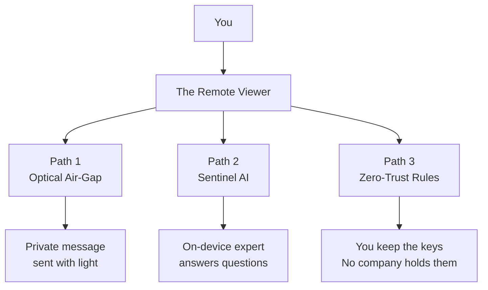
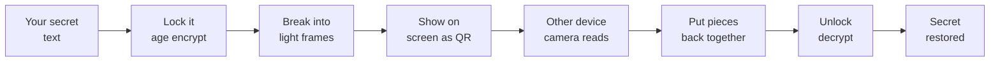
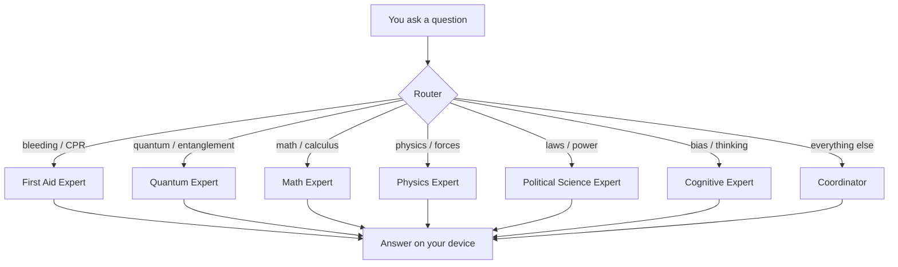
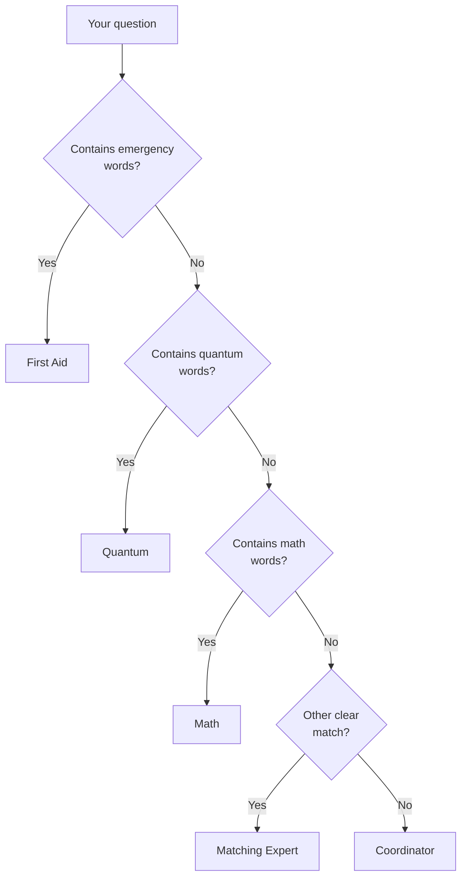
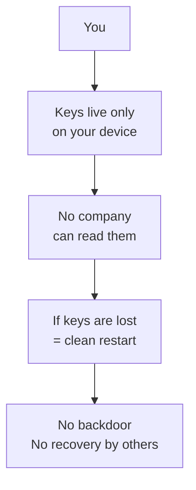
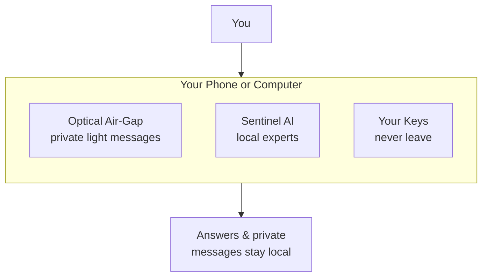

# Visual Guide — The Remote Viewer

**No jargon required.** Follow the pictures.

---

## The whole project at a glance



---

## Path 1 — Optical Air-Gap

**What it does:** Sends a secret message using only light (screen → camera). No internet. No cables.



**In plain words:**
1. You type a secret.
2. It gets locked.
3. The locked secret is turned into flashing QR codes.
4. Another phone or computer watches the screen.
5. It rebuilds the secret and unlocks it.
6. No network was used.

---

## Path 2 — Sentinel AI (the expert system)

**What it does:** Answers questions using different experts. Everything stays on your phone.



**In plain words:**
1. You ask something.
2. A small router decides which expert should answer.
3. Only that expert’s rules are used.
4. The answer is generated on your phone.
5. Nothing is sent to the cloud.

---

## How the router chooses



Life-safety questions always win.

---

## Path 3 — Zero-Trust / You own the keys

**What it does:** Makes sure no company, cloud, or platform can control your identity or secrets.



**In plain words:**
- Your keys never leave your device.
- There is no “forgot password” controlled by someone else.
- If the keys are gone, you start over clean.
- That is intentional. It is called **Destroy = Restart**.

---

## Putting it together



Nothing required leaves the device. That is the point.

---

## Quick start commands (optional)

Only if you want to try the pieces yourself:

**Optical air-gap**
```bash
cd optical-airgap/rust
bash ../scripts/e2e-age-lt.sh
```

**See which expert would answer**
```bash
cd grok/router
python route.py "how do I control severe bleeding"
```

---

**Digital sovereignty is not a slogan. It is a terminal that never phones home.**
