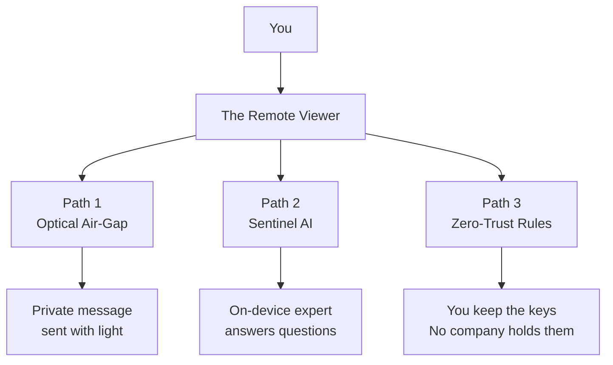
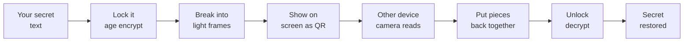
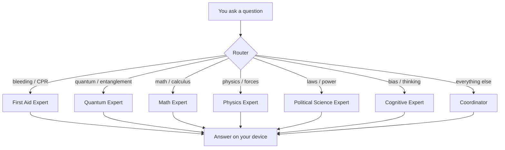
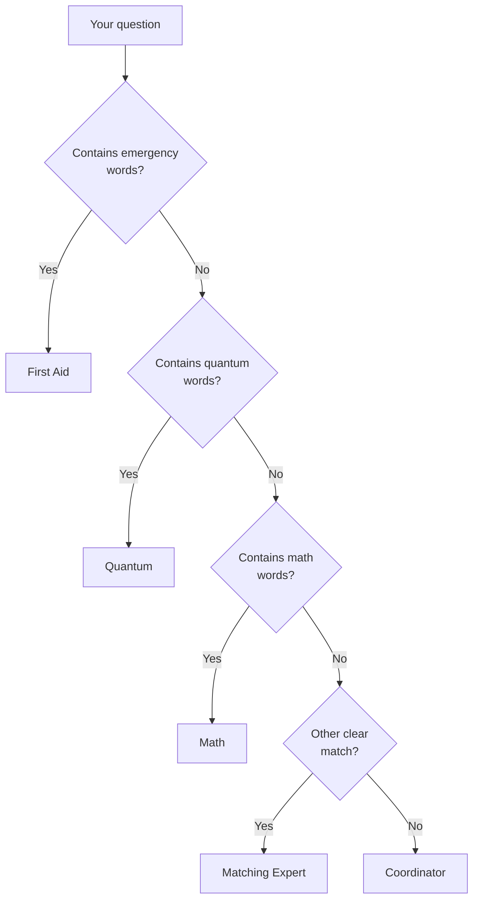
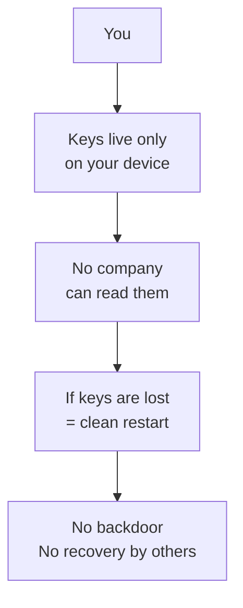

# Visual Guide — The Remote Viewer

**For everyone.** Pictures for people who learn by sight. Full text for people who use screen readers, braille, or prefer words. Same information in both forms.

---

## Accessibility statement

This guide is written so you can understand the project whether you:

- See the diagrams
- Use a screen reader
- Prefer plain text only
- Need large print or high contrast (use your device settings)
- Navigate by keyboard only

**How to use this page:**
- Every diagram is followed by a **Text alternative** that says the same thing in order.
- Headings are structured so a screen reader can jump section by section.
- No information is conveyed by color alone.
- Language stays simple on purpose.

If anything is still hard to follow, open an issue and we will fix the wording.

---

## 1. The whole project at a glance

### Picture (diagram)



### Text alternative (screen reader / plain text)

You start at “You.”  
You go into “The Remote Viewer.”  
From there you can take one of three paths:

1. **Path 1 — Optical Air-Gap** → ends with “Private message sent with light.”
2. **Path 2 — Sentinel AI** → ends with “On-device expert answers questions.”
3. **Path 3 — Zero-Trust Rules** → ends with “You keep the keys. No company holds them.”

### In everyday words

This project gives you three tools:
- A way to send private messages using only light between screens and cameras.
- A set of local experts on your own device that answer questions.
- Rules that keep your keys and identity under your control, not a company’s.

---

## 2. Path 1 — Optical Air-Gap (private messages with light)

**What it does:** Sends a secret message using only light (one screen to another camera). No internet. No cables.

### Picture (diagram)



### Text alternative (step by step)

1. Start with your secret text.
2. Lock it (encrypt it).
3. Break the locked secret into light frames.
4. Show those frames on a screen as QR codes.
5. Another device’s camera reads the frames.
6. That device puts the pieces back together.
7. It unlocks (decrypts) the message.
8. The secret is restored on the other device.

### Mental picture

Imagine writing a note, putting it in a locked box, cutting the box into puzzle pieces, flashing the pieces as pictures on a TV, and having a friend film the TV and reassemble the puzzle so they can open the box. No one on the internet ever sees the note.

---

## 3. Path 2 — Sentinel AI (local experts)

**What it does:** Answers questions using different experts. Everything stays on your phone or computer.

### Picture (diagram)



### Text alternative (step by step)

1. You ask a question.
2. A router looks at the question.
3. If the question is about bleeding or CPR → First Aid Expert.
4. If the question is about quantum or entanglement → Quantum Expert.
5. If the question is about math or calculus → Math Expert.
6. If the question is about physics or forces → Physics Expert.
7. If the question is about laws or power → Political Science Expert.
8. If the question is about bias or thinking → Cognitive Expert.
9. If none of those match → Coordinator.
10. Whichever expert is chosen produces the answer on your device.

### Mental picture

You walk up to a desk. A receptionist listens to your question and sends you to the right specialist in the building. The specialist answers you. No one outside the building hears the conversation.

---

## 4. How the router decides (priority order)

### Picture (diagram)



### Text alternative (decision order)

1. Look at your question.
2. Does it contain emergency words (bleeding, CPR, etc.)?  
   - Yes → First Aid. Stop.  
   - No → continue.
3. Does it contain quantum words?  
   - Yes → Quantum. Stop.  
   - No → continue.
4. Does it contain math words?  
   - Yes → Math. Stop.  
   - No → continue.
5. Is there another clear match?  
   - Yes → that Matching Expert.  
   - No → Coordinator.

**Rule:** Life-safety questions always go first.

---

## 5. Path 3 — Zero-Trust (you own the keys)

**What it does:** Makes sure no company, cloud, or platform can control your identity or secrets.

### Picture (diagram)



### Text alternative (step by step)

1. You hold the keys.
2. The keys live only on your device.
3. No company can read them.
4. If the keys are lost, the system does a clean restart.
5. There is no backdoor and no recovery controlled by someone else.

### Mental picture

Your house key stays on your keyring. The locksmith does not keep a copy. If you lose the key, you change the locks and start fresh. No one else can open the door for you, and no one else can open it against your will.

This is called **Destroy = Restart** on purpose.

---

## 6. Everything stays on your device

### Picture (diagram)


### Text alternative

- You interact with your own phone or computer.
- Inside that device are three things:  
  1. Optical Air-Gap (private light messages)  
  2. Sentinel AI (local experts)  
  3. Your Keys (they never leave)
- The result is that answers and private messages stay local.

### Everyday meaning

Nothing required for these features has to leave your device. That is the design goal.

---

## 7. Quick start commands (optional)

Only if you want to try the pieces yourself. These are technical steps.

**Optical air-gap demo**
```bash
cd optical-airgap/rust
bash ../scripts/e2e-age-lt.sh
```

**See which expert would answer a question**
```bash
cd grok/router
python route.py "how do I control severe bleeding"
```

---

## 8. How this guide supports accessibility

| Need | How this page helps |
|------|---------------------|
| Screen reader | Every diagram has a full text alternative in reading order |
| Keyboard only | Standard heading structure; no mouse-only controls |
| Low vision | Use your system zoom / high-contrast settings; text is plain |
| Cognitive load | Short sentences, numbered steps, one idea at a time |
| No vision | Text alternatives convey the same sequence as the diagrams |
| Prefer pictures | Mermaid diagrams are provided for visual scanning |

We do not rely on color alone to carry meaning.

---

**Digital sovereignty is not a slogan. It is a terminal that never phones home.**
